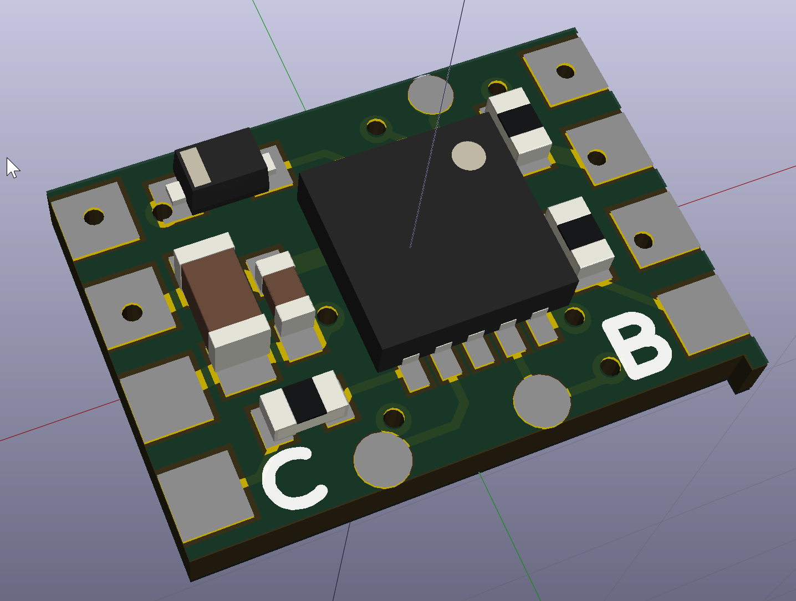
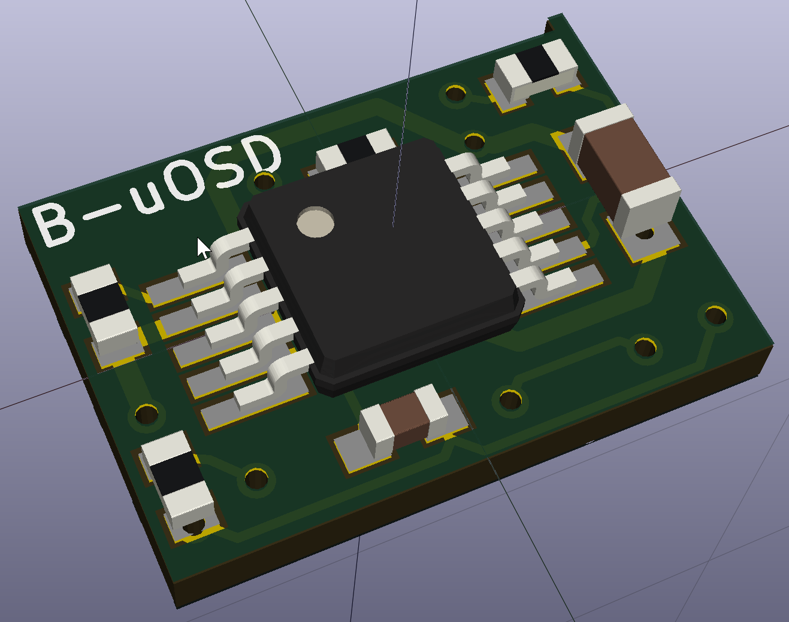

# Battery voltage microOSD V1.0
It is very small and simple OSD for monitoring Battery voltage.

- Supports 1S-4S battery monitoring. (Changing onboard voltage divider can be extended for bigger batteries.)
- Supply voltage 3.3-5.5v.
- Low supply current, no heat generation.
- It is very small size (8.8mm X 6mm).
- Virtually weights nothing.
- Some Configurable parameters via Serial

It has minuses too.
- Very basic (only one voltage monitoring)
- Due to small and slow mcu (no special mcu for signal generation) the OSD picture is not as stable as other bigger OSDs.

## Configuration
There is (C)onfiguration pin. BAUDRATE is 19200.
### Connection
Connect to PC or tablet with any Serial2USB converter. Connect 3 wires: 
- OSD VCC -> Serial2USB VCC
- OSD GND -> Serial2USB GND
- OSD C -> Serial2USB TX

OSD can be connected to the video signal to see changes on screen in live.
### Changing configuration
1. To enter to configuration mode, type in terminal UUU and press enter. OSD will disappear from the screen.
2. Enter any of the commands. After changing any parameter OSD will come back to the screen for 4 seconds.
3. When you satisfied with the changes, save them to EEPROM.
### Available commands
Every command has 4 characters
- **XXXX** - Exit from Configuration mode without saving changes to EEPROM (after power cycle current settings will be lost).
- **SSSS** - Save settings to the EEPROM and exit from Configuration mode (after power cycle new settings will be applied).
- **FFFF** - Restore Factory settings and reboot device.
- **TTTT** - Test settings. Show OSD on screen for 4 seconds in Configuration mode.
- **Lnnn** - Set the *line* where voltage will be printed. nnn number in format 000. Useful range is about 030 to 280.
- **Cnnn** - Set the *column* where voltage will be printed. nnn number in format 000. Useful range is about 001 to 130.
- **Vsnn** - Adjust voltage and exit from Configuration mode. You can adjust it if OSD battery voltage is a bit different from real battery voltage. snn number in format [sign]00. In place of [sign] can be used '-' or '0' indicating sign of number. Allowed range is -99 to 099. 1=100mV (if you enter V-05, OSD voltage will be reduced for 500mV). 
- **Wnnn** - Set low voltage threshold. If voltage drops below this value, OSD voltage will blink. nnn number in format 000. Allowed range is 001 to 254.

